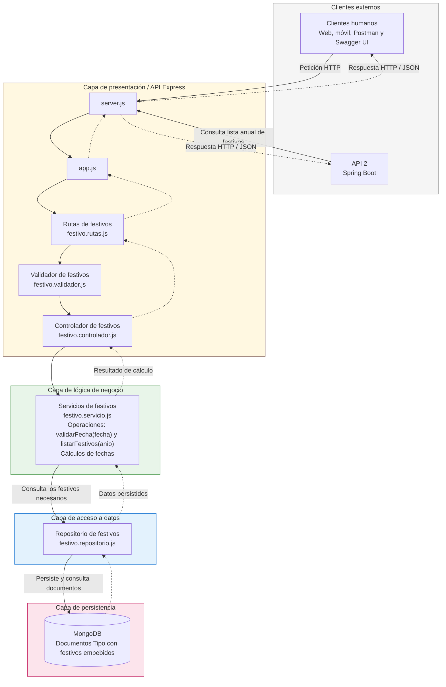

# Diagrama de arquitectura por capas — API de Festivos

```mermaid
graph TD
    subgraph Clientes [Clientes externos]
        Humanos[Clientes humanos<br/>Web, móvil, Postman y Swagger UI]
        API2[API 2<br/>Spring Boot]
    end

    subgraph Presentacion [Capa de presentación / API Express]
        Server[server.js]
        App[app.js]
        Rutas[Rutas de festivos<br/>festivo.rutas.js]
        Validador[Validador de festivos<br/>festivo.validador.js]
        Controlador[Controlador de festivos<br/>festivo.controlador.js]
    end

    subgraph Negocio [Capa de lógica de negocio]
        Servicios["Servicios de festivos<br/>festivo.servicio.js<br/>Operaciones: validarFecha(fecha) y listarFestivos(anio)<br/>Cálculos de fechas"]
    end

    subgraph Datos [Capa de acceso a datos]
        Repositorio[Repositorio de festivos<br/>festivo.repositorio.js]
    end

    subgraph Persistencia [Capa de persistencia]
        Mongo[(MongoDB<br/>Documentos Tipo con festivos embebidos)]
    end

    Humanos -->|Petición HTTP| Server
    API2 -->|Consulta lista anual de festivos| Server
    Server --> App
    App --> Rutas
    Rutas --> Validador
    Validador --> Controlador
    Controlador --> Servicios
    Servicios -->|Consulta los festivos necesarios| Repositorio
    Repositorio -->|Persiste y consulta documentos| Mongo

    Mongo -.-> Repositorio
    Repositorio -.->|Datos persistidos| Servicios
    Servicios -.->|Resultado de cálculo| Controlador
    Controlador -.-> Rutas
    Rutas -.-> App
    App -.-> Server
    Server -.->|Respuesta HTTP / JSON| Humanos
    Server -.->|Respuesta HTTP / JSON| API2

    style Clientes fill:#f5f5f5,stroke:#616161,stroke-width:1px
    style Presentacion fill:#fff8e1,stroke:#8d6e63,stroke-width:1px
    style Negocio fill:#e8f5e9,stroke:#388e3c,stroke-width:1px
    style Datos fill:#e3f2fd,stroke:#1976d2,stroke-width:1px
    style Persistencia fill:#fce4ec,stroke:#c2185b,stroke-width:1px
```

Los servicios concentran los cálculos de fechas; el repositorio se limita a la consulta y persistencia de los documentos MongoDB.
